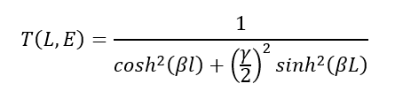

### Quantum Tunnelling Through Potential Barriers

Quantum tunneling, a fundamental phenomenon in quantum mechanics, challenges classical notions of particle behavior by allowing particles to traverse potential barriers that would be impassable according to classical laws. This phenomenon has profound implications across various scientific disciplines, from fundamental physics to technological advancements.

In our experiment, we aim to investigate and quantify the process of quantum tunneling using an interactive simulation. By designing an experiment that demonstrates the principles of tunneling, we seek to deepen our understanding of quantum mechanics and provide valuable insights into the behavior of particles at the quantum level.

---

### Key Concepts

#### 1. Quantum Tunneling Phenomenon
Quantum tunneling occurs when a particle encounters a potential energy barrier that exceeds its total energy. In classical mechanics, such a barrier would prevent the particle from passing through. However, according to quantum mechanics, there is a non-zero probability that the particle will penetrate the barrier and emerge on the other side.

#### 2. Schrödinger Equation and Wave Functions
The behavior of particles in the presence of a potential barrier is described by the time-independent Schrödinger equation:

$\frac{d^2 \psi}{dx^2} + \frac{2m}{\hbar^2}(E - Vo)\psi = 0$

<table style="width:100%; border-collapse: collapse; margin: 20px 0;">
<tr style="background: linear-gradient(135deg, #667eea, #764ba2); color: white;">
<th style="padding: 12px; border: 1px solid #ddd; text-align: left;">Symbol</th>
<th style="padding: 12px; border: 1px solid #ddd; text-align: left;">Description</th>
</tr>
<tr><td style="padding: 8px; border: 1px solid #ddd; text-align: center;">ℏ</td><td style="padding: 8px; border: 1px solid #ddd;">Reduced Planck constant (h/2π)</td></tr>
<tr style="background: #f9f9f9;"><td style="padding: 8px; border: 1px solid #ddd; text-align: center;">m</td><td style="padding: 8px; border: 1px solid #ddd;">Mass of the particle</td></tr>
<tr><td style="padding: 8px; border: 1px solid #ddd; text-align: center;">E</td><td style="padding: 8px; border: 1px solid #ddd;">Energy eigenvalues (Particle Energy)</td></tr>
<tr style="background: #f9f9f9;"><td style="padding: 8px; border: 1px solid #ddd; text-align: center;">Ψ(x)</td><td style="padding: 8px; border: 1px solid #ddd;">Wavefunction of the particle</td></tr>
<tr><td style="padding: 8px; border: 1px solid #ddd; text-align: center;">V₀</td><td style="padding: 8px; border: 1px solid #ddd;">Height of the potential barrier</td></tr>
<tr style="background: #f9f9f9;"><td style="padding: 8px; border: 1px solid #ddd; text-align: center;">L</td><td style="padding: 8px; border: 1px solid #ddd;">Width of the potential barrier</td></tr>
</table>

#### 3. Transmission Coefficient
The transmission coefficient **T(L, E)** represents the probability of a particle tunnelling through a potential barrier of width L and total energy E. It is given by the formula:

**T(E) = e-2κL** where **κ = √(2m(V₀-E)/ℏ²)**

---

### Simulation Parameters

<table style="width:100%; border-collapse: collapse; margin: 20px 0;">
<tr style="background: linear-gradient(135deg, #667eea, #764ba2); color: white;">
<th style="padding: 12px; border: 1px solid #ddd;">Parameter</th>
<th style="padding: 12px; border: 1px solid #ddd;">Symbol</th>
<th style="padding: 12px; border: 1px solid #ddd;">Description</th>
<th style="padding: 12px; border: 1px solid #ddd;">Range in Simulation</th>
</tr>
<tr><td style="padding: 8px; border: 1px solid #ddd;">Particle Energy</td><td style="padding: 8px; border: 1px solid #ddd; text-align: center;">E</td><td style="padding: 8px; border: 1px solid #ddd;">Energy of the incoming quantum particle</td><td style="padding: 8px; border: 1px solid #ddd; text-align: center;">0 to 0.100</td></tr>
<tr style="background: #f9f9f9;"><td style="padding: 8px; border: 1px solid #ddd;">Barrier Height</td><td style="padding: 8px; border: 1px solid #ddd; text-align: center;">V₀</td><td style="padding: 8px; border: 1px solid #ddd;">Height of the potential energy barrier</td><td style="padding: 8px; border: 1px solid #ddd; text-align: center;">-0.1 to 0.1</td></tr>
<tr><td style="padding: 8px; border: 1px solid #ddd;">Barrier Width</td><td style="padding: 8px; border: 1px solid #ddd; text-align: center;">L</td><td style="padding: 8px; border: 1px solid #ddd;">Width of the potential barrier</td><td style="padding: 8px; border: 1px solid #ddd; text-align: center;">0 to 51 units</td></tr>
<tr style="background: #f9f9f9;"><td style="padding: 8px; border: 1px solid #ddd;">Ramp Gradient</td><td style="padding: 8px; border: 1px solid #ddd; text-align: center;">-</td><td style="padding: 8px; border: 1px solid #ddd;">Smoothness of barrier edges</td><td style="padding: 8px; border: 1px solid #ddd; text-align: center;">0 to 50</td></tr>
</table>

---

### Learning Scenarios

<table style="width:100%; border-collapse: collapse; margin: 20px 0;">
<tr style="background: linear-gradient(135deg, #667eea, #764ba2); color: white;">
<th style="padding: 12px; border: 1px solid #ddd;">Scenario</th>
<th style="padding: 12px; border: 1px solid #ddd;">Configuration</th>
<th style="padding: 12px; border: 1px solid #ddd;">Expected Observation</th>
</tr>
<tr><td style="padding: 8px; border: 1px solid #ddd;">🟢 Easy Tunnel</td><td style="padding: 8px; border: 1px solid #ddd;">High E, Low V₀</td><td style="padding: 8px; border: 1px solid #ddd;">High transmission probability - most wave passes through</td></tr>
<tr style="background: #f9f9f9;"><td style="padding: 8px; border: 1px solid #ddd;">🟡 Balanced</td><td style="padding: 8px; border: 1px solid #ddd;">E ≈ V₀</td><td style="padding: 8px; border: 1px solid #ddd;">Partial tunnelling - wave splits into reflected and transmitted parts</td></tr>
<tr><td style="padding: 8px; border: 1px solid #ddd;">🔴 Hard Tunnel</td><td style="padding: 8px; border: 1px solid #ddd;">Low E, High V₀</td><td style="padding: 8px; border: 1px solid #ddd;">Very low transmission - most wave is reflected</td></tr>
<tr style="background: #f9f9f9;"><td style="padding: 8px; border: 1px solid #ddd;">📚 Classical</td><td style="padding: 8px; border: 1px solid #ddd;">E > V₀</td><td style="padding: 8px; border: 1px solid #ddd;">Energy exceeds barrier - observe quantum effects</td></tr>
<tr><td style="padding: 8px; border: 1px solid #ddd;">📏 Wide Barrier</td><td style="padding: 8px; border: 1px solid #ddd;">Large L</td><td style="padding: 8px; border: 1px solid #ddd;">Transmission decreases exponentially with width (T ∝ e^(-2κL))</td></tr>
<tr style="background: #f9f9f9;"><td style="padding: 8px; border: 1px solid #ddd;">📶 Step Potential</td><td style="padding: 8px; border: 1px solid #ddd;">Width = ∞</td><td style="padding: 8px; border: 1px solid #ddd;">Wave reflection at discontinuity - no classical analogue</td></tr>
</table>

---

### Key Observations
1. **Transmission Coefficient** decreases exponentially as barrier width (L) increases
2. **Higher particle energy** (E) leads to greater tunnelling probability
3. When **E < V₀**, tunnelling still occurs (purely quantum phenomenon)
4. When **E > V₀**, classical physics allows passage, but quantum effects still appear
5. The **wavefunction** decays exponentially inside the barrier region

---

### Real-World Applications of Quantum Tunnelling
- **Radioactive Alpha Decay**: Alpha particles tunnel through nuclear potential barrier
- **Scanning Tunnelling Microscope (STM)**: Uses tunnelling current to image surfaces
- **Tunnel Diodes**: Electronic components using quantum tunnelling
- **Nuclear Fusion in Stars**: Particles tunnel through Coulomb barrier
