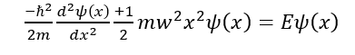

### Quantum tunnelling through potential barriers
Quantum tunneling, a fundamental phenomenon in quantum mechanics, challenges classical notions of particle behavior by allowing particles to traverse potential barriers that would be impassable according to classical laws. This phenomenon has profound implications across various scientific disciplines, from fundamental physics to technological advancements.
In our experiment, we aim to investigate and quantify the process of quantum tunneling using a simple yet illustrative setup. By designing an experiment that demonstrates the principles of tunneling, we seek to deepen our understanding of quantum mechanics and provide valuable insights into the behavior of particles at the quantum level.
Quantum Tunneling Phenomenon:
Quantum tunneling occurs when a particle encounters a potential energy barrier that exceeds its total energy. In classical mechanics, such a barrier would prevent the particle from passing through. However, according to quantum mechanics, there is a non-zero probability that the particle will penetrate the barrier and emerge on the other side.
Schrödinger Equation and Wave Functions:
The behavior of particles in the presence of a potential barrier is described by the time-independent Schrödinger equation:
 
Where: 
	ℏ is the reduced Plank constant,  
	m is the mass of the particle, 
	ω is the angular frequency of the oscillator potential, 
	E represents the energy eigenvalues 
	Ψ(x) denotes the wavefunction. 
Transmission Coefficient: 
The transmission coefficient T (L, E) represents the probability of a particle tunnelling through a potential barrier of width L and total energy E. It is given by the formula: 
 
Where: 
1.  is the parameter related to the potential energy of the barrier, 
2.  is another parameter related to the barrier and energy, and Uo the height of the potential barrier.

