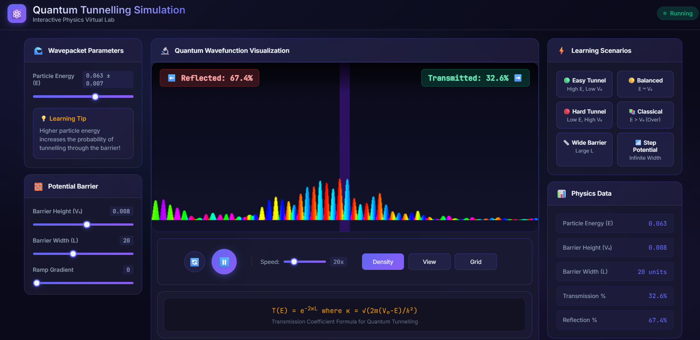

#### Step 1: Understanding the Interface
Open the simulation and familiarize yourself with the control panels:
- **Left Panel**: Wavepacket Parameters and Potential Barrier controls
- **Center**: Visualization canvas showing the quantum wavefunction
- **Right Panel**: Learning Scenarios and Physics Data

---

#### Step 2: Set Initial Parameters
<table style="width:100%; border-collapse: collapse; margin: 20px 0;">
<tr style="background: linear-gradient(135deg, #667eea, #764ba2); color: white;">
<th style="text-align: center; border: 1px solid #ddd;">Parameter</th>
<th style="text-align: center; border: 1px solid #ddd;">Recommended Initial Value</th>
<th style="text-align: center; border: 1px solid #ddd;">Purpose</th>
</tr>
<tr><td style="padding: 8px; border: 1px solid #ddd; text-align: center;">Particle Energy (E)</td><td style="padding: 8px; border: 1px solid #ddd; text-align: center;">0.030</td><td style="padding: 8px; border: 1px solid #ddd; text-align: center;">Energy of incoming wavepacket</td></tr>
<tr style="background: #f9f9f9;"><td style="padding: 8px; border: 1px solid #ddd; text-align: center;">Barrier Height (V₀)</td><td style="padding: 8px; border: 1px solid #ddd; text-align: center;">0.040</td><td style="padding: 8px; border: 1px solid #ddd; text-align: center;">Height of potential barrier</td></tr>
<tr><td style="padding: 8px; border: 1px solid #ddd; text-align: center;">Barrier Width (L)</td><td style="padding: 8px; border: 1px solid #ddd; text-align: center;">20</td><td style="padding: 8px; border: 1px solid #ddd; text-align: center;">Width of the barrier region</td></tr>
<tr style="background: #f9f9f9;"><td style="padding: 8px; border: 1px solid #ddd; text-align: center;">Ramp Gradient</td><td style="padding: 8px; border: 1px solid #ddd; text-align: center;">0</td><td style="padding: 8px; border: 1px solid #ddd; text-align: center;">Keep sharp edges initially</td></tr>
</table>

---

#### Step 3: Start the Simulation
1. Click the **▶️ Play** button to start the animation
2. Observe the wavepacket moving towards the barrier
3. Watch the **Reflected %** and **Transmitted %** values change in real-time.

---

#### Step 4: Explore Learning Scenarios
Try each preset scenario from the right panel:
1. 🟢 **Easy Tunnel** - Observe high transmission
2. 🟡 **Balanced** - See wave splitting
3. 🔴 **Hard Tunnel** - Notice low transmission
4. 📚 **Classical** - Compare with classical behavior
5. 📏 **Wide Barrier** - Observe exponential decay
6. 📶 **Step Potential** - Study step function behavior

---

#### Step 5: Display Options
Use the display options in the visualization panel:
- **Density**: Shows probability density |Ψ|² with phase as color
- **View**: Shows Real and Imaginary parts of the wavefunction
- **Grid**: Enable grid for reference measurements

---

#### Step 6: Collect Data
Record your observations in the table below:

<table style="width:100%; border-collapse: collapse; margin: 20px 0;">
<tr style="background: linear-gradient(135deg, #667eea, #764ba2); color: white;">
<th style="padding: 12px; border: 1px solid #ddd; text-align: center;">S.No</th>
<th style="padding: 12px; border: 1px solid #ddd; text-align: center;">Particle Energy (E)</th>
<th style="padding: 12px; border: 1px solid #ddd; text-align: center;">Barrier Height (V₀)</th>
<th style="padding: 12px; border: 1px solid #ddd; text-align: center;">Barrier Width (L)</th>
<th style="padding: 12px; border: 1px solid #ddd; text-align: center;">Transmission %</th>
<th style="padding: 12px; border: 1px solid #ddd; text-align: center;">Reflection %</th>
</tr>
<tr><td style="padding: 8px; border: 1px solid #ddd; text-align: center;">1</td><td style="padding: 8px; border: 1px solid #ddd; text-align: center;">0.030</td><td style="padding: 8px; border: 1px solid #ddd; text-align: center;">0.040</td><td style="padding: 8px; border: 1px solid #ddd; text-align: center;">20</td><td style="padding: 8px; border: 1px solid #ddd; text-align: center;">1.04%</td><td style="padding: 8px; border: 1px solid #ddd; text-align: center;">98.96%</td></tr>
<tr style="background: #f9f9f9;"><td style="padding: 8px; border: 1px solid #ddd; text-align: center;">2</td><td style="padding: 8px; border: 1px solid #ddd; text-align: center;">0.060</td><td style="padding: 8px; border: 1px solid #ddd; text-align: center;">0.020</td><td style="padding: 8px; border: 1px solid #ddd; text-align: center;">15</td><td style="padding: 8px; border: 1px solid #ddd; text-align: center;">96.79%</td><td style="padding: 8px; border: 1px solid #ddd; text-align: center;">3.21%</td></tr>
<tr><td style="padding: 8px; border: 1px solid #ddd; text-align: center;">3</td><td style="padding: 8px; border: 1px solid #ddd; text-align: center;">0.035</td><td style="padding: 8px; border: 1px solid #ddd; text-align: center;">0.035</td><td style="padding: 8px; border: 1px solid #ddd; text-align: center;">25</td><td style="padding: 8px; border: 1px solid #ddd; text-align: center;">8.38%</td><td style="padding: 8px; border: 1px solid #ddd; text-align: center;">91.62%</td></tr>
<tr style="background: #f9f9f9;"><td style="padding: 8px; border: 1px solid #ddd; text-align: center;">4</td><td style="padding: 8px; border: 1px solid #ddd; text-align: center;">0.020</td><td style="padding: 8px; border: 1px solid #ddd; text-align: center;">0.050</td><td style="padding: 8px; border: 1px solid #ddd; text-align: center;">30</td><td style="padding: 8px; border: 1px solid #ddd; text-align: center;">≈ 0.00%</td><td style="padding: 8px; border: 1px solid #ddd; text-align: center;">≈ 100.00%</td></tr>
<tr><td style="padding: 8px; border: 1px solid #ddd; text-align: center;">5</td><td style="padding: 8px; border: 1px solid #ddd; text-align: center;">0.070</td><td style="padding: 8px; border: 1px solid #ddd; text-align: center;">0.050</td><td style="padding: 8px; border: 1px solid #ddd; text-align: center;">10</td><td style="padding: 8px; border: 1px solid #ddd; text-align: center;">73.04%</td><td style="padding: 8px; border: 1px solid #ddd; text-align: center;">26.96%</td></tr>
<tr style="background: #f9f9f9;"><td style="padding: 8px; border: 1px solid #ddd; text-align: center;">6</td><td style="padding: 8px; border: 1px solid #ddd; text-align: center;">0.045</td><td style="padding: 8px; border: 1px solid #ddd; text-align: center;">0.030</td><td style="padding: 8px; border: 1px solid #ddd; text-align: center;">40</td><td style="padding: 8px; border: 1px solid #ddd; text-align: center;">89.25%</td><td style="padding: 8px; border: 1px solid #ddd; text-align: center;">10.75%</td></tr>
</table>

---

#### Step 7: Analyze the Effect of Barrier Width
Keep E and V₀ constant, vary only the Barrier Width (L):

<table style="width:100%; border-collapse: collapse; margin: 20px 0;">
<tr style="background: linear-gradient(135deg, #667eea, #764ba2); color: white;">
<th style="padding: 12px; border: 1px solid #ddd; text-align: center;">S.No</th>
<th style="padding: 12px; border: 1px solid #ddd; text-align: center;">Barrier Width (L)</th>
<th style="padding: 12px; border: 1px solid #ddd; text-align: center;">Transmission %</th>
<th style="padding: 12px; border: 1px solid #ddd; text-align: center;">Observation</th>
</tr>
<tr><td style="padding: 8px; border: 1px solid #ddd; text-align: center;">1</td><td style="padding: 8px; border: 1px solid #ddd; text-align: center;">10</td><td style="padding: 8px; border: 1px solid #ddd; text-align: center;">16.69%</td><td style="padding: 8px; border: 1px solid #ddd; text-align: center;">High transmission with thin barrier</td></tr>
<tr style="background: #f9f9f9;"><td style="padding: 8px; border: 1px solid #ddd; text-align: center;">2</td><td style="padding: 8px; border: 1px solid #ddd; text-align: center;">20</td><td style="padding: 8px; border: 1px solid #ddd; text-align: center;">1.04%</td><td style="padding: 8px; border: 1px solid #ddd; text-align: center;">~16x drop from L=10 — exponential decay begins</td></tr>
<tr><td style="padding: 8px; border: 1px solid #ddd; text-align: center;">3</td><td style="padding: 8px; border: 1px solid #ddd; text-align: center;">30</td><td style="padding: 8px; border: 1px solid #ddd; text-align: center;">0.062%</td><td style="padding: 8px; border: 1px solid #ddd; text-align: center;">Exponential decay clearly observed (T ∝ e-2κL)</td></tr>
<tr style="background: #f9f9f9;"><td style="padding: 8px; border: 1px solid #ddd; text-align: center;">4</td><td style="padding: 8px; border: 1px solid #ddd; text-align: center;">40</td><td style="padding: 8px; border: 1px solid #ddd; text-align: center;">0.0037%</td><td style="padding: 8px; border: 1px solid #ddd; text-align: center;">Very low transmission with thick barrier</td></tr>
<tr><td style="padding: 8px; border: 1px solid #ddd; text-align: center;">5</td><td style="padding: 8px; border: 1px solid #ddd; text-align: center;">50</td><td style="padding: 8px; border: 1px solid #ddd; text-align: center;">0.0002%</td><td style="padding: 8px; border: 1px solid #ddd; text-align: center;">Near-zero transmission, confirms T ∝ e-2κL</td></tr>
</table>

---

#### Step 8: Plot the Graph
Using your collected data, plot a graph with:
- **X-axis**: Barrier Width (L)
- **Y-axis**: Transmission Percentage (%)

Observe the exponential relationship: **T ∝ e-2κL**

 

Fig.1 Quantum Wavefunction Visualization in Density form

 

Fig.2 Quantum Wavefunction Visualization in frequency form

---

#### Step 9: Conclusions
Based on your observations, answer:
1. How does particle energy affect tunnelling probability?
2. How does barrier width affect transmission coefficient?
3. What happens when E > V₀ (classical regime)?
4. Why does tunnelling probability never become exactly zero?
